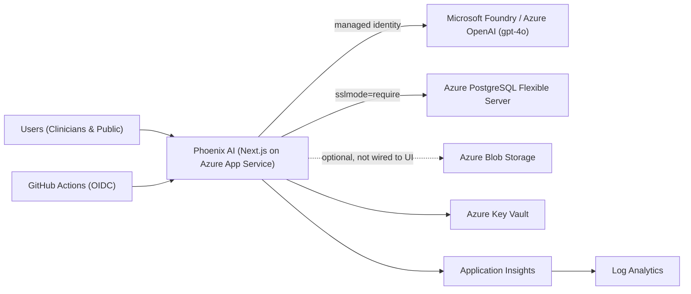

# Phoenix AI — Burn & Wound Care Assessment Tool (Azure)

> **This project is a parity migration of the Phoenix AI application from Abacus.AI to Microsoft Azure.**
>
> It is a **faithful migration, not a redesign**. The Azure version preserves the original
> Phoenix AI name, branding, logo, page/navigation structure, colour palette, typography,
> spacing, components, charts, animations, responsive behaviour, clinical terminology and
> user journeys as closely as technically possible. Changes are made only where an
> incompatibility prevents faithful migration, and such changes are documented in the
> migration audit trail.

- **Source application (Abacus.AI):** https://phoenixai-burnandwound.abacusai.app/hcp
- **Application name:** Phoenix AI — Burn & Wound Care Assessment Tool
- **Migration audit trail:** [docs/migration/MIGRATION.md](docs/migration/MIGRATION.md)
- **Current architecture (AS-IS):** [docs/architecture/current-architecture.md](docs/architecture/current-architecture.md)
- **Target architecture:** [docs/architecture/ARCHITECTURE.md](docs/architecture/ARCHITECTURE.md)
- **Test strategy:** [docs/testing/TEST-STRATEGY.md](docs/testing/TEST-STRATEGY.md)

---

## What this app is

Phoenix AI is an AI-powered clinical decision support tool for **burn and wound care** in
Malaysia, with two portals:

- **`/hcp`** — Healthcare Professional portal (dashboard, wound-image analysis, clinical
  chat, TBSA estimator, Parkland fluid calculator, guidelines).
- **`/community`** — Public/community portal (first-aid guides, self-assessment, image check,
  articles, chat).

It supports English and Bahasa Melayu, and ships as an installable PWA.

## Tech stack (imported from source)

| Layer | Technology |
| --- | --- |
| Framework | Next.js 14 (App Router), React 18 |
| Language | TypeScript 5 |
| Styling | Tailwind CSS 3 + shadcn/ui (Radix), framer-motion |
| Charts | recharts, chart.js, plotly.js |
| AI | OpenAI-compatible chat completions (vision + streaming) |
| Runtime | Node.js 22 (see [.nvmrc](.nvmrc)) |

The application source lives under [`nextjs_space/`](nextjs_space/) exactly as imported.

## Runtime dependency on Azure

The **only live backend dependency** is the LLM used by the API routes
(`app/api/analyze-wound`, `hcp-chat`, `community-chat`, `community-analyze`). In the source
it targets Abacus.AI's OpenAI-compatible endpoint; on Azure it is migrated to **Azure OpenAI**
(vision-capable deployment). Prisma/PostgreSQL and AWS S3 helpers exist in the codebase but
are **not wired into the running UI** — see the migration audit trail for details.

The deployed application does **not** depend on a developer laptop, local database, local file
share or `localhost` service.

## Local development

> Prerequisites: Node.js 22 (`nvm use`), npm.

```powershell
cd nextjs_space
npm install --legacy-peer-deps   # pre-existing eslint peer conflict; runtime unaffected
copy ..\.env.example .env         # then fill in local values (never commit .env)
npm run dev                       # http://localhost:3000
```

Production build:

```powershell
cd nextjs_space
npm run build
npm run start
```

## Configuration

Copy [`.env.example`](.env.example) to `nextjs_space/.env` for local development. **No secrets
are committed to this repository.** On Azure, configuration is supplied via App Service /
Container Apps app settings, with secrets sourced from Azure Key Vault.

## Architecture

> Architecture version: **1.0.0** (see [docs/architecture/ARCHITECTURE_VERSION](docs/architecture/ARCHITECTURE_VERSION)).

Phoenix AI runs as a Next.js standalone server on Azure App Service, calling Azure OpenAI
(Microsoft Foundry `gpt-4o`) via a managed identity, with PostgreSQL, Blob Storage, Key Vault,
Application Insights and Log Analytics in `rg-phoenixai-demo`.



This project follows an **architecture-first change policy**: no material change is implemented
until the current architecture is understood, documented and impact-assessed, and the docs stay
synchronized with the code (enforced by the `Architecture Governance` CI workflow).

- **Current architecture (AS-IS):** [docs/architecture/current-architecture.md](docs/architecture/current-architecture.md)
- **Component inventory:** [docs/architecture/component-inventory.md](docs/architecture/component-inventory.md)
- **Integration inventory:** [docs/architecture/integration-inventory.md](docs/architecture/integration-inventory.md)
- **Azure resource map:** [docs/architecture/azure-resource-map.md](docs/architecture/azure-resource-map.md)
- **Decisions (ADRs):** [docs/architecture/decisions/](docs/architecture/decisions/)
- **Change records:** [docs/architecture/changes/](docs/architecture/changes/)
- **Diagrams:** [docs/architecture/diagrams/](docs/architecture/diagrams/)

## Repository layout

```
.
├─ nextjs_space/            # Imported Phoenix AI application (Next.js) — source of truth
├─ Uploads/                 # Sample clinical images from the source (reference only)
├─ docs/
│  ├─ migration/            # Migration audit trail & step log
│  ├─ architecture/         # Current (AS-IS) + target architecture, ADRs, diagrams, changes
│  └─ testing/              # Test & UI-parity strategy
├─ .github/
│  ├─ workflows/            # CI + Architecture Governance
│  ├─ PULL_REQUEST_TEMPLATE.md
│  └─ copilot-instructions.md
├─ AGENTS.md                # Architecture-first change policy for agents & contributors
├─ .editorconfig
├─ .nvmrc
├─ .env.example             # Config template (no secrets)
└─ README.md
```

## Contributing & branch protection

See [CONTRIBUTING.md](CONTRIBUTING.md) for the workflow and the **recommended branch
protection rules** for `main`.

## License / status

Internal migration project. Original Phoenix AI branding and assets are used as supplied by
the source application; do not replace the Phoenix AI logo.
