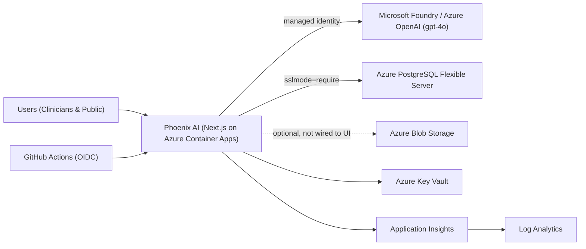

# Phoenix AI — Burn & Wound Care Assessment Tool (Azure)

> **This project is a parity migration of the Phoenix AI application from Abacus.AI to Microsoft Azure.**
>
> It is a **faithful migration, not a redesign**. The Azure version preserves the original
> Phoenix AI name, branding, logo, page/navigation structure, colour palette, typography,
> spacing, components, charts, animations, responsive behaviour, clinical terminology and
> user journeys as closely as technically possible. Changes are made only where an
> incompatibility prevents faithful migration, and such changes are documented in the
> migration audit trail.

- **Source application (Abacus.AI):** https://phoenixai-burnandwound.abacusai.app/hcp
- **Application name:** Phoenix AI — Burn & Wound Care Assessment Tool
- **Migration audit trail:** [docs/migration/MIGRATION.md](docs/migration/MIGRATION.md)
- **Current architecture (AS-IS):** [docs/architecture/current-architecture.md](docs/architecture/current-architecture.md)
- **Target architecture:** [docs/architecture/ARCHITECTURE.md](docs/architecture/ARCHITECTURE.md)
- **Test strategy:** [docs/testing/TEST-STRATEGY.md](docs/testing/TEST-STRATEGY.md)

---

## Application

Phoenix AI is an AI-powered clinical decision support tool for **burn and wound care** in
Malaysia. There is one Phoenix AI experience with two portals:

- **`/hcp`** — Healthcare Professional portal (dashboard, wound-image analysis, clinical
  chat, TBSA estimator, Parkland fluid calculator, guidelines).
- **`/community`** — Public/community portal (first-aid guides, self-assessment, image check,
  articles, chat).

The root `/` is the single Phoenix AI landing page. It links directly to the HCP and Community
portals above. The app also ships as an installable PWA.

## Language

The complete retained experience supports English and Bahasa Melayu through one persisted,
application-wide language selection. UI labels, navigation, clinical notices, calculators, chat,
and image-analysis requests follow the selected language.

## Clinical Support

Phoenix AI is AI-assisted **clinical decision-support**, not autonomous diagnosis. AI output must be
reviewed by a qualified healthcare professional and does not replace professional clinical
judgement. The HCP analysis, chat, TBSA, and Parkland surfaces display this warning.

## Privacy

Use demo data only. Do not enter unnecessary patient identifiers or confidential information.
Developers and users remain responsible for following applicable Malaysian personal-data protection
requirements. Images are processed ephemerally unless an explicitly authorized persistence flow is
enabled.

## Tech stack (imported from source)

| Layer | Technology |
| --- | --- |
| Framework | Next.js 14 (App Router), React 18 |
| Language | TypeScript 5 |
| Styling | Tailwind CSS 3 + shadcn/ui (Radix), framer-motion |
| Charts | recharts, chart.js, plotly.js |
| AI | OpenAI-compatible chat completions (vision + streaming) |
| Runtime | Node.js 22 (see [.nvmrc](.nvmrc)) |

The application source lives under [`nextjs_space/`](nextjs_space/) exactly as imported.

## Runtime dependency on Azure

AI routes use an Azure AI/OpenAI-compatible vision deployment through managed identity. Azure
PostgreSQL supports authorized HCP analysis history; private Blob Storage is provisioned but remains
unwired to the current UI. See the current architecture for exact runtime boundaries.

The deployed application does **not** depend on a developer laptop, local database, local file
share or `localhost` service.

## Development

This repository runs in **PROTOTYPE / DEMO DEVELOPMENT MODE**. A developer decides when a coherent
change is ready, commits it explicitly, and pushes once. There is no daemon that commits every
Copilot edit or deploys every keystroke.

> Prerequisites: Node.js 22 (`nvm use`), npm.

```powershell
cd nextjs_space
npm install --legacy-peer-deps   # pre-existing eslint peer conflict; runtime unaffected
copy ..\.env.example .env         # then fill in local values (never commit .env)
npm run dev                       # http://localhost:3000
```

Quick verification:

```powershell
cd nextjs_space
npm run verify                    # typecheck + production build
```

## Codespaces

[`.devcontainer/devcontainer.json`](.devcontainer/devcontainer.json) provides Node.js 22, Azure CLI,
GitHub CLI, Copilot support, useful Azure/TypeScript extensions, dependency installation, and port
`3000` forwarding. Codespaces terminals start in `nextjs_space`, so the npm commands are immediately
available. No secrets are baked into the container configuration.

```text
Open Codespace
→ Ask Copilot to change the app
→ npm run verify
→ git add .
→ git commit
→ git push origin main
→ automatic Azure deployment
```

## Deployment

One explicit push to `main` triggers [`.github/workflows/deploy.yml`](.github/workflows/deploy.yml).
It validates, builds, applies committed database migrations, deploys an immutable SHA-tagged image to
the existing Azure Container App, waits for the exact new revision, and smoke-tests HCP and Community.
OIDC and managed identity are retained; no client secret is stored in the workflow.

## Rollback

Rollback restores a previously deployed immutable image without rewriting Git history. From a
Codespace or other authenticated shell, pass the full deployed Git SHA:

```bash
scripts/rollback-demo.sh <full-40-character-git-sha>
```

The helper asks for confirmation and dispatches the same deployment workflow. The workflow verifies
the image exists, deploys it without rerunning migrations, checks health/smoke tests, and records the
requesting actor, restored SHA, and resulting Container App revision in its summary.

## Configuration

Copy [`.env.example`](.env.example) to `nextjs_space/.env` for local development. **No secrets
are committed to this repository.** On Azure, configuration is supplied via App Service /
Container Apps app settings, with secrets sourced from Azure Key Vault.

## Architecture

> Architecture version: **6.0.0** (see [docs/architecture/ARCHITECTURE_VERSION](docs/architecture/ARCHITECTURE_VERSION)).

Phoenix AI runs as a Next.js standalone server on Azure Container Apps, calling the environment-owned
Azure AI Services `gpt-4o` deployment through managed identity, with PostgreSQL, Blob Storage, Key
Vault, Application Insights and Log Analytics in `rg-phoenixai-bfgs-demo`.



This is explicitly a **PROTOTYPE / DEMO DEVELOPMENT MODE** repository. Keep architecture and RAI
documentation reasonably current in the same task; there is no pre-change approval or PR gate.

- **Current architecture (AS-IS):** [docs/architecture/current-architecture.md](docs/architecture/current-architecture.md)
- **Component inventory:** [docs/architecture/component-inventory.md](docs/architecture/component-inventory.md)
- **Integration inventory:** [docs/architecture/integration-inventory.md](docs/architecture/integration-inventory.md)
- **Azure resource map:** [docs/architecture/azure-resource-map.md](docs/architecture/azure-resource-map.md)
- **Decisions (ADRs):** [docs/architecture/decisions/](docs/architecture/decisions/)
- **Change records:** [docs/architecture/changes/](docs/architecture/changes/)
- **Diagrams:** [docs/architecture/diagrams/](docs/architecture/diagrams/)

## Responsible AI & AI Assurance

AI output in Phoenix AI is **clinical decision-support under human supervision**, not an autonomous
diagnosis. Responsible AI controls are surfaced as a first-class layer with a **code-based control
register** as the single source of truth ([`nextjs_space/lib/rai/controls.ts`](nextjs_space/lib/rai/controls.ts)),
mapped to Microsoft's six Responsible AI principles and traced to code and tests.

- Clinically sensitive values (Parkland fluid resuscitation, Lund & Browder TBSA) are computed
  **deterministically**, never guessed by the model.
- Deterministic safety rules run after every analysis: no fabricated measurements, Fitzpatrick /
  ethnicity **non-inference**, schema validation, automated consistency review, special-site
  escalation, confidence capping and safe failure.
- Every result is **AI-labelled**, carries confidence + explicit limitations, and is presented for
  **clinician review** (reviewed / modified / escalated).
- Controls are graded honestly **Active / Partial / Planned**. Phoenix AI makes **no** claim of being
  "certified", "approved", "bias free" or "100% safe".

The governed documentation and test evidence are the current assurance review surface; the retained
clinical interface does not yet display the complete metadata envelope. Tests: `npm run test:rai`.
Full documentation: [docs/rai/](docs/rai/README.md) (start with the
[executive summary](docs/rai/executive-summary.md)).

## Repository layout

```
.
├─ nextjs_space/            # Imported Phoenix AI application (Next.js) — source of truth
├─ Uploads/                 # Sample clinical images from the source (reference only)
├─ docs/
│  ├─ migration/            # Migration audit trail & step log
│  ├─ architecture/         # Current (AS-IS) + target architecture, ADRs, diagrams, changes
│  ├─ rai/                  # Responsible AI framework, controls, evidence & limitations
│  └─ testing/              # Test & UI-parity strategy
├─ .github/
│  ├─ workflows/            # One automatic deploy + manual infrastructure
│  └─ copilot-instructions.md
├─ AGENTS.md                # Prototype contributor guidance
├─ .editorconfig
├─ .nvmrc
├─ .env.example             # Config template (no secrets)
└─ README.md
```

## Contributing & repository workflow

Open a Codespace, edit with Copilot, run `npm run verify`, commit a coherent change, and push directly
to `main`. The single deployment workflow validates the app and updates Azure automatically. Pull
requests and manual approvals are optional, not required. See [CONTRIBUTING.md](CONTRIBUTING.md).

## License / status

Internal migration project. Original Phoenix AI branding and assets are used as supplied by
the source application; do not replace the Phoenix AI logo.
