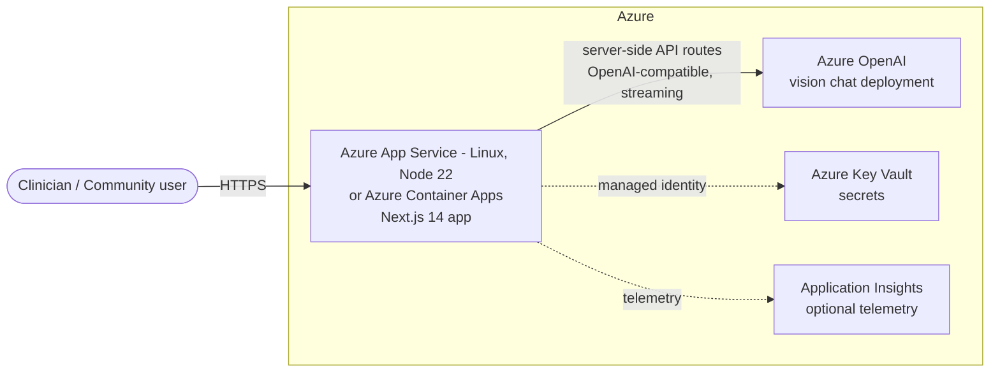

# Target Azure Architecture — Phoenix AI

This document describes the **target** Azure architecture for the faithful migration of
Phoenix AI from Abacus.AI. It is a living document; sections are confirmed as each migration
step lands. See [../migration/MIGRATION.md](../migration/MIGRATION.md) for the audit trail.

## Design principle

Preserve the visible user experience exactly. Replace only the **platform** underneath: swap
Abacus.AI-hosted services for Azure-hosted equivalents with identical request/response and
streaming behaviour.

## Runtime dependency analysis (from source)

| Source dependency | Wired into running UI? | Azure target |
| --- | --- | --- |
| **LLM** — Abacus.AI OpenAI-compatible chat completions (vision + streaming), `ABACUSAI_API_KEY` | **Yes** — the only live backend dependency. | **Azure OpenAI** vision deployment (e.g. `gpt-4o`), OpenAI-compatible chat completions. |
| PostgreSQL via Prisma (`lib/db.ts`, `prisma/schema.prisma`) | **No** — not imported by any page/route; dashboard/article data is mock/client-side. | Deferred. Azure Database for PostgreSQL Flexible Server only if persistence is later required. |
| AWS S3 (`lib/s3.ts`, `lib/aws-config.ts`) | **No** — not imported; images sent to the LLM as base64 via `FileReader`. | Deferred. Azure Blob Storage (`@azure/storage-blob` already present) only if upload persistence is required. |
| Abacus chat widget script in `app/layout.tsx` | Platform artifact, not Phoenix AI UI | To be removed (platform-injected). |

**Consequence:** the faithful runtime needs only **static Next.js hosting + one Azure OpenAI
backend**. No database or object store is required to reproduce the current UX.

## Target topology (planned)

### Components

- **Hosting** — Azure App Service (Linux, Node 22) or Azure Container Apps for the Next.js app.
  The app's API routes proxy the LLM server-side, so the model key is never exposed to the browser.
- **AI** — Azure OpenAI, a vision-capable chat-completions deployment, replacing the Abacus.AI
  endpoint. Request/response shape and Server-Sent-Events streaming are preserved.
- **Secrets** — Azure Key Vault; the app reads configuration from App Service settings and
  authenticates to Key Vault via **managed identity** (no secrets in source or images).
- **Telemetry (optional)** — Application Insights for request/error monitoring.

## Non-negotiables

- No developer-laptop, `localhost`, local DB, or local file-share dependency in the deployed runtime.
- Reuse existing suitable Azure resources; new resource group only for what cannot be reused.
- No secrets committed to git.

## Open decisions

- **Hosting choice** (App Service vs Container Apps) — to be finalised at the deployment step.
- **Azure OpenAI resource** — reuse an existing account/deployment vs provision new (pending user input).
- **Model mapping** — source uses `gpt-5.4-mini` (vision); Azure target model/deployment name TBD.
