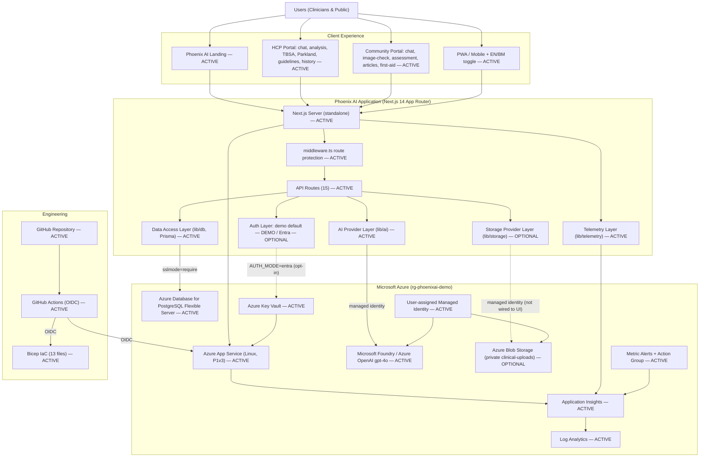

# Phoenix AI — Current Architecture (AS-IS)

> **Authoritative AS-IS architecture document.** It describes the system exactly as
> implemented in the repository at the current HEAD and as deployed in Azure
> (`rg-phoenixai-demo`, `southeastasia`) at the time of writing. It is part of the source code
> and MUST remain synchronized with the implementation (see
> [ARCHITECTURE-FIRST CHANGE POLICY](../../.github/copilot-instructions.md)).
>
> Architecture version: see [ARCHITECTURE_VERSION](./ARCHITECTURE_VERSION) (currently `1.0.0`).
> Change history: [ARCHITECTURE_CHANGELOG.md](./ARCHITECTURE_CHANGELOG.md).

Status vocabulary used throughout:

| Marker | Meaning |
| --- | --- |
| **Implemented** / `ACTIVE` | Present in code and used at runtime |
| **Partially implemented** | Present and used for some paths only |
| **Configured but unused** / `OPTIONAL` | Present and wired to infrastructure, but no visible UI workflow uses it |
| **Mock/demo** / `DEMO` | Fictional/demonstration behaviour |
| **Planned** / `PLANNED` | Not implemented |
| **Deprecated** / `LEGACY` | Retained for parity, not a runtime dependency |

---

## 1. System overview

**Purpose.** Phoenix AI is a burn and wound-care assessment demonstration tool for Malaysian
healthcare contexts. It offers AI-assisted wound/burn image analysis and clinical chat for
healthcare professionals (HCP), and simplified guidance for the public (Community).

> This is a **demonstration parity migration with an operational foundation** — not a clinically
> validated or production-hardened system. See
> [tradeoffs-and-limitations.md](../migration/tradeoffs-and-limitations.md).

| Concern | Current state |
| --- | --- |
| Application runtime | Next.js 14 (App Router), React 18, TypeScript 5, standalone Node server (`node server.js`) — **Implemented** |
| Major portals | Landing, HCP portal, Community portal, PWA + EN/BM — **Implemented** |
| Hosting | Azure App Service (Linux, P1v3), `southeastasia` — **Implemented** |
| AI processing | Azure OpenAI (Microsoft Foundry) `gpt-4o` via `lib/ai` provider, managed identity — **Implemented** |
| Data handling | Azure PostgreSQL Flexible Server via Prisma; used by HCP history; other screens render demo content — **Partially implemented** |
| Authentication | Server-verified **demo** login by default; Microsoft Entra ID **opt-in** placeholder — **Mock/demo + Optional** |
| Storage | Azure Blob provider present + infra provisioned; no UI workflow persists files — **Configured but unused** |
| Monitoring | Application Insights + Log Analytics + health probes + metric alerts — **Implemented** |
| Deployment | GitHub Actions (OIDC) + Bicep IaC — **Implemented** |

---

## 2. Current architecture diagram

The authoritative source is [diagrams/current-architecture.mmd](./diagrams/current-architecture.mmd).
It is embedded here and must be kept in sync with it.

Companion diagrams:
[data flow](./diagrams/current-data-flow.mmd) ·
[deployment](./diagrams/current-deployment.mmd) ·
[AI architecture](./diagrams/current-ai-architecture.mmd).

---

## 3. Application layers

### 3.1 Experience Layer

| Element | Location | Status |
| --- | --- | --- |
| Landing page | `app/_components/*`, `app/page.tsx` | Implemented |
| HCP portal (chat, analysis, TBSA, Parkland, guidelines, history) | `app/hcp/*` | Implemented |
| Community portal (chat, image-check, assessment, articles, first-aid) | `app/community/*` | Implemented |
| PWA install + service worker | `components/pwa-install-prompt.tsx`, `components/pwa-register.tsx`, `public/` | Implemented |
| English / Bahasa Malaysia | `components/language-provider.tsx`, `components/language-toggle.tsx`, `lib/i18n.ts` | Implemented |
| Responsive interface + theming | Tailwind + shadcn/ui, `components/theme-*` | Implemented |

### 3.2 Application Layer

| Element | Location | Status |
| --- | --- | --- |
| Next.js App Router | `app/` | Implemented |
| Server + client components | `app/**/_components/*`, layouts | Implemented |
| API routes (15) | `app/api/**/route.ts` | Implemented |
| Middleware (route protection) | `middleware.ts` | Implemented |
| Instrumentation hook (startup env validation) | `instrumentation.ts` | Implemented |
| Providers (language, theme, telemetry) | `components/*-provider.tsx` | Implemented |
| Hooks | `hooks/use-toast.ts` | Implemented |
| Shared types | `types/next-auth.d.ts`, `lib/types.ts` | Implemented |

### 3.3 AI Layer

| Element | Location | Status |
| --- | --- | --- |
| AI provider factory | `lib/ai/ai-provider.ts` → `getAiProvider()` returns `AzureFoundryProvider` (single provider; abstraction retained) | Implemented |
| Model endpoint | Azure OpenAI / Foundry, `gpt-4o`, api-version `2024-10-21` | Implemented |
| Model selection (purpose-specific) | `lib/ai/model-config.ts` — `AZURE_AI_ANALYSIS_MODEL_DEPLOYMENT` / `AZURE_AI_CHAT_MODEL_DEPLOYMENT` (default to `AZURE_AI_MODEL_DEPLOYMENT`) | Implemented |
| Credential | `lib/ai/azure-credential.ts` (`DefaultAzureCredential`, key fallback) | Implemented |
| OpenAI-compatible mapping | `lib/ai/openai-compatible.ts` | Implemented |
| System prompts (HCP vs Community) | `lib/ai/prompts/{hcp-chat,hcp-wound-analysis,community-chat,community-wound-analysis}.ts` | Implemented |
| Staged analysis prompts | `lib/ai/prompts/{wound-visual-observation,wound-clinical-interpretation,wound-management,wound-analysis-critic}.ts` | Implemented |
| Staged analysis pipeline | `lib/ai/analysis/pipeline.ts` (`runAnalysisPipeline`, `assembleAnalysis`) — default for `/api/analyze-wound`; flag `AI_ANALYSIS_PIPELINE=single` reverts | Implemented |
| Deterministic clinical calc | `lib/clinical/{parkland,tbsa}.ts` reused by the pipeline — no assumed patient weight | Implemented |
| Rich analysis schema + adapter | `lib/ai/schemas/burn-wound-analysis.ts` (observation vs interpretation, field confidence, gaps) + flat back-compat adapter | Implemented |
| Streaming | `lib/ai/streaming/{sse,collect,text-stream}.ts` | Implemented |
| Image analysis (multimodal) | `lib/ai/validation/image-input.ts` + vision model | Implemented |
| Structured response validation | `lib/ai/validation/wound-analysis-schema.ts` (Zod, 22-field contract) | Implemented |
| Analysis evaluation harness | `tests/evaluation/burn-wound/` (structural/safety; live optional) | Implemented (structure); live pending |
| AI telemetry | `lib/ai/telemetry.ts` | Implemented |

**Wound image analysis flow (`/api/analyze-wound`).** The default `staged` pipeline runs four
sequential model stages — visual observation → clinical interpretation + quantification →
management & referral → consistency/safety critic — then applies deterministic post-processing:
Parkland is computed in app code from a supplied weight (never an assumed 70 kg), Fitzpatrick is
reported only when the clinician supplies it (otherwise `unknown`), measurements are `unavailable`
without a visible scale reference, confidence is capped on poor-quality images, and special-site
burns are escalated. The rich result is mapped back to the existing 22-field contract (so the
client and SSE envelope are unchanged) and the full structure travels under `result.structured`
for the enhanced UI and the REFINE (second-pass) flow. Setting `AI_ANALYSIS_PIPELINE=single`
restores the original single-pass call.

### 3.4 Data Layer

| Element | Location | Status |
| --- | --- | --- |
| Prisma client | `lib/db.ts` (auto `sslmode=require`, pool defaults) | Implemented |
| PostgreSQL | Azure Database for PostgreSQL Flexible Server | Implemented (infra) |
| Models: `Case`, `ChatMessage`, `Article` | `prisma/schema.prisma` | Present, **not wired to UI** (parity demo content) |
| Model: `AnalysisRecord` | `prisma/schema.prisma` | Implemented — used by HCP history |
| Migrations + seed | `prisma/migrations/*`, `scripts/{seed,seed-data,safe-seed}.ts` | Implemented (fictional data) |
| Client-side state / session storage | React state; login uses server session cookie | Implemented |
| Static/demo content | in-app demo data, `lib/i18n.ts` | Implemented |

### 3.5 Storage Layer

| Element | Location | Status |
| --- | --- | --- |
| Azure Blob provider | `lib/storage/{azure-blob-provider,storage-provider,types}.ts` (managed identity, private container, SAS reads) | **Configured but unused** — no UI workflow persists files |
| Remaining S3 code | — | **None** (removed; see [removals.md](../migration/removals.md)) |
| Browser-based image handling | client-side `FileReader` → base64 to AI routes | Implemented |
| Temporary image processing | ephemeral base64 in request body | Implemented |

### 3.6 Identity Layer

| Element | Location | Status |
| --- | --- | --- |
| Demo authentication | `lib/auth/demo-provider.ts`, `demo-users.ts` (fictional users; default `AUTH_MODE=demo`) | Mock/demo |
| Session (signed httpOnly cookie) | `lib/auth/session.ts`, `current-session.ts` (`jose` HS256) | Implemented |
| Entra ID (OIDC) | `lib/auth/entra-*.ts`, `app/api/auth/entra/*` (opt-in `AUTH_MODE=entra`; placeholder in this release) | Optional |
| Roles (Doctor/Nurse/Administrator) | `lib/auth/*` role mapping | Implemented (used by demo; Entra role mapping opt-in) |
| Route protection | `middleware.ts` | Implemented |

### 3.7 Observability Layer

| Element | Location | Status |
| --- | --- | --- |
| Application Insights (server + browser) | `lib/telemetry/{server,client,correlation}.ts`, `components/telemetry-provider.tsx`, `instrumentation.ts` | Implemented |
| Log Analytics | Azure (App Insights workspace-based) | Implemented |
| Health checks | `app/api/health/{route,live,ready,db}.ts`, `lib/health/readiness.ts` | Implemented |
| Metric alerts + action group | `infra/modules/alerts.bicep` | Implemented |
| Logging | privacy-safe (no clinical content) | Implemented |

### 3.8 Deployment Layer

| Element | Location | Status |
| --- | --- | --- |
| GitHub repository | remote `origin` | Implemented |
| GitHub Actions | `.github/workflows/{ci,deploy-demo,deploy-dev,infrastructure,db-migrate}.yml` | Implemented |
| OIDC federation | workflows | Implemented |
| Bicep IaC (13 files) | `infra/main.bicep`, `infra/main.bicepparam`, `infra/modules/*` | Implemented |
| Azure App Service | `app-phoenixai-yun55ezsi4yoq` | Implemented |
| Deployment slots | — | **Not implemented** (single production slot) |

---

## 4. Source vs deployment

The source code contains capabilities that are **provisioned but not exercised by any visible
workflow** in the deployed demo:

| Capability | Source | Deployed behaviour |
| --- | --- | --- |
| Blob Storage | `lib/storage/*` present | Storage account provisioned; readiness reports `blob-storage=ok`, but **no UI persists files** |
| Entra ID auth | `lib/auth/entra-*` present | `AUTH_MODE=demo` in the demo → Entra path inactive |
| PostgreSQL persistence | full Prisma schema | Only `AnalysisRecord` (HCP history) is read/written; other models hold parity demo content |

Feature gating is driven by presence of environment variables, read centrally in
`lib/config/environment.ts` (AI essential; DB enabled iff `DATABASE_URL`; Blob enabled iff
`AZURE_STORAGE_ACCOUNT`/`_URL`). See [azure-resource-map.md](./azure-resource-map.md).

---

## 5. Cross-references

- Component inventory → [component-inventory.md](./component-inventory.md)
- Integration inventory → [integration-inventory.md](./integration-inventory.md)
- Azure resource map → [azure-resource-map.md](./azure-resource-map.md)
- Architecture decisions → [decisions/README.md](./decisions/README.md)
- Change records → [changes/](./changes/)
- Source-to-Azure migration report → [../migration/phoenix-ai-azure-migration-report.md](../migration/phoenix-ai-azure-migration-report.md)
