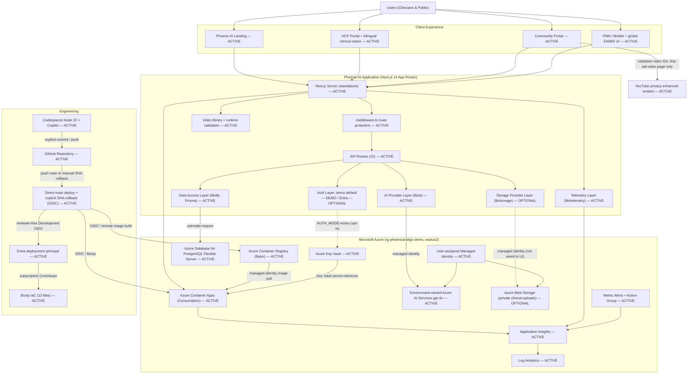

# Phoenix AI — Current Architecture (AS-IS)

> **Authoritative AS-IS architecture document.** It describes the system exactly as
> implemented in the repository at the current HEAD. The current customer deployment target is
> `rg-phoenixai-bfgs-demo` in `eastus2`, with all workload resources including Azure AI owned by
> that environment. It is part of the source code
> and should be kept reasonably current with implementation during each prototype task.
>
> Architecture version: see [ARCHITECTURE_VERSION](./ARCHITECTURE_VERSION) (currently `8.1.0`).
> Change history: [ARCHITECTURE_CHANGELOG.md](./ARCHITECTURE_CHANGELOG.md).

Status vocabulary used throughout:

| Marker | Meaning |
| --- | --- |
| **Implemented** / `ACTIVE` | Present in code and used at runtime |
| **Partially implemented** | Present and used for some paths only |
| **Configured but unused** / `OPTIONAL` | Present and wired to infrastructure, but no visible UI workflow uses it |
| **Mock/demo** / `DEMO` | Fictional/demonstration behaviour |
| **Planned** / `PLANNED` | Not implemented |
| **Deprecated** / `LEGACY` | Retained for parity, not a runtime dependency |

---

## 1. System overview

**Purpose.** Phoenix AI is a burn and wound-care assessment demonstration tool for Malaysian
healthcare contexts. It offers AI-assisted wound/burn image analysis and clinical chat for
healthcare professionals (HCP), and simplified guidance for the public (Community).

> This is a **demonstration parity migration with an operational foundation** — not a clinically
> validated or production-hardened system. See
> [tradeoffs-and-limitations.md](../migration/tradeoffs-and-limitations.md).

| Concern | Current state |
| --- | --- |
| Application runtime | Next.js 14 (App Router), React 18, TypeScript 5, standalone Node server (`node server.js`) — **Implemented** |
| Major portals | One Phoenix AI landing, HCP routes, Community routes for first aid, first-aid video, burn prevention, self-assessment, articles and chat, PWA, and global English/Bahasa Melayu UI — **Implemented** |
| Hosting | Azure Container Apps Consumption, `eastus2`; image in Azure Container Registry Basic — **Implemented** |
| AI processing | Environment-owned Azure AI Services S0 account with `gpt-4o` via `lib/ai`, managed identity — **Implemented** |
| Data handling | Azure PostgreSQL Flexible Server 17.10 via Prisma; used by HCP history; other screens render demo content — **Partially implemented** |
| Authentication | Server-verified **demo** login by default; Microsoft Entra ID **opt-in** placeholder — **Mock/demo + Optional** |
| Storage | Azure Blob provider present + infra provisioned; no UI workflow persists files — **Configured but unused** |
| Monitoring | Application Insights + Log Analytics + health probes + metric alerts — **Implemented** |
| Development | GitHub Codespaces with Node.js 22, npm dependencies, Azure/GitHub CLIs, Copilot extensions, and port 3000 forwarding — **Implemented** |
| Deployment | Direct pushes to `main` run one approval-free `deploy.yml` path using GitHub OIDC; explicit manual rollback restores a known immutable SHA image without rewriting history; infrastructure is manual-only — **Implemented** |

---

## 2. Current architecture diagram

The authoritative source is [diagrams/current-architecture.mmd](./diagrams/current-architecture.mmd).
It is embedded here and must be kept in sync with it.

Companion diagrams:
[data flow](./diagrams/current-data-flow.mmd) ·
[deployment](./diagrams/current-deployment.mmd) ·
[AI architecture](./diagrams/current-ai-architecture.mmd).

---

## 3. Application layers

### 3.1 Experience Layer

| Element | Location | Status |
| --- | --- | --- |
| Public landing (single Phoenix AI entry) | `app/page.tsx`, `app/_components/landing-client.tsx` | Implemented |
| HCP portal (chat, analysis, TBSA, Parkland, guidelines, history) | `app/hcp/*` | Implemented |
| Community portal (chat, assessment, articles, first-aid, first-aid video and burn prevention; retired image route redirects home) | `app/community/*` | Implemented |
| Retired alternate experience | Runtime source, components, libraries, flags, assets and tests removed; recoverable from Git history only | Removed |
| PWA install + service worker | `components/pwa-install-prompt.tsx`, `components/pwa-register.tsx`, `public/` | Implemented |
| Global English / Bahasa Melayu UI | Root `LanguageProvider`, `components/language-toggle.tsx`, `lib/i18n/{en,ms,index}.ts`; persisted `AppLanguage` (`en`/`ms`) | Implemented |
| Bilingual clinical/data notices + demo boundary | `components/clinical-ai-notice.tsx`, `components/demo-environment-badge.tsx`; contextual notices on analysis/upload/results, chat/input, TBSA and Parkland | Implemented |
| Analysis failure recovery | `app/hcp/analysis/_components/analysis-client.tsx`; selected image and form context remain available with exact bilingual retry/replacement actions | Implemented |
| Existing-result language switching | HCP analysis and History clients call text-only `/api/analyze-wound/translate`, cache EN/MS representations, retain the original on failure, and never resend the image | Implemented |
| Responsive interface + theming | Tailwind + shadcn/ui, `components/theme-*` | Implemented |

### 3.2 Application Layer

| Element | Location | Status |
| --- | --- | --- |
| Next.js App Router | `app/` | Implemented |
| Server + client components | `app/**/_components/*`, layouts | Implemented |
| API routes (15) | `app/api/**/route.ts` | Implemented |
| Middleware (route protection) | `middleware.ts` | Implemented |
| Instrumentation hook (startup env validation) | `instrumentation.ts` | Implemented |
| Community first-aid video library | `lib/config/first-aid-videos.ts`, `lib/config/first-aid-video.ts`; validates the enabled ordered library, applies `FIRST_AID_VIDEO_URL` as an optional featured override, deduplicates by video ID and returns only allowlisted privacy-enhanced embed data | Implemented |
| Providers (language, theme, telemetry) | `components/*-provider.tsx` | Implemented |
| Hooks | `hooks/use-toast.ts` | Implemented |
| Shared types | `types/next-auth.d.ts`, `lib/types.ts` | Implemented |

### 3.3 AI Layer

| Element | Location | Status |
| --- | --- | --- |
| AI provider factory | `lib/ai/ai-provider.ts` → `getAiProvider()` returns `AzureFoundryProvider`; categorized safe errors and retry policy remain provider-neutral | Implemented |
| Model endpoint | Environment-owned Azure AI Services, `gpt-4o` `2024-11-20` Global Standard, api-version `2024-10-21` | Implemented |
| Model selection (purpose-specific) | `lib/ai/model-config.ts` — `AZURE_AI_ANALYSIS_MODEL_DEPLOYMENT` / `AZURE_AI_CHAT_MODEL_DEPLOYMENT` (default to `AZURE_AI_MODEL_DEPLOYMENT`) | Implemented |
| Credential | `lib/ai/azure-credential.ts` (`DefaultAzureCredential`, key fallback) | Implemented |
| OpenAI-compatible mapping | `lib/ai/openai-compatible.ts` | Implemented |
| Active system prompts (HCP analysis/chat and Community chat, strict EN/MS response instruction) | `lib/ai/prompts/{hcp-chat,hcp-wound-analysis,community-chat}.ts`, `lib/ai/language.ts` | Implemented |
| Staged analysis prompts | `lib/ai/prompts/{wound-visual-observation,wound-clinical-interpretation,wound-management,wound-analysis-critic}.ts`; receive the selected output language | Implemented |
| AI output-language validation | `lib/ai/language.ts`; detects predominantly wrong-language completions, retries once with a rewrite instruction, logs language codes only | Implemented |
| Existing-analysis translation | `lib/ai/analysis/translation.ts`, `/api/analyze-wound/translate`; translates narrative text only, validates protected canonical/numeric values unchanged, and receives no image | Implemented |
| Staged analysis pipeline | `lib/ai/analysis/pipeline.ts` (`runAnalysisPipeline`, `assembleAnalysis`) — default for `/api/analyze-wound`; rejects empty/malformed core output, retains explicit unreadable/non-burn output as a low-information result, preserves canonical structured enums while localizing narrative EN/MS; flag `AI_ANALYSIS_PIPELINE=single` reverts | Implemented |
| Deterministic clinical calc | `lib/clinical/{parkland,tbsa}.ts` reused by the pipeline — Image Analysis requires an explicit adult/child category, applies >=15%/>=10% indication thresholds, and calculates only with supplied weight | Implemented |
| Rich analysis schema + adapter | `lib/ai/schemas/burn-wound-analysis.ts` (observation vs interpretation, field confidence, gaps) + flat back-compat adapter | Implemented |
| Streaming | `lib/ai/streaming/{sse,collect,text-stream}.ts`; interrupted/empty structured streams are categorized | Implemented |
| Image analysis input | `lib/ai/validation/image-input.ts` accepts JPEG, PNG, WebP, and GIF; validates MIME, base64, signature, decoded dimensions/integrity, and size before model invocation | Implemented |
| Structured response validation | Zod contracts plus fenced/commentary JSON extraction, one repair attempt, empty/malformed core-output rejection, explicit unreadable/non-burn degradation, and non-core fallbacks | Implemented |
| Analysis timeout/retries | `AI_ANALYSIS_TIMEOUT_MS` bounded default; maximum three attempts for 408/429/500/502/503/504 and transient network errors, honoring `Retry-After` | Implemented |
| Analysis evaluation harness | `tests/evaluation/burn-wound/` (structural/safety; live optional) | Implemented (structure); live pending |
| API reliability harness | `tests/reliability/image-analysis-reliability.ts` with safe demo-image inputs; sequential and optional concurrent execution | Implemented; live execution operator-triggered |
| AI telemetry | `lib/ai/telemetry.ts`, `lib/telemetry/analysis-events.ts`; privacy-safe analysis lifecycle events | Implemented |
| Azure filter classification | `lib/ai/content-filter.ts`, transport and stream collection; records only allowlisted input/output category/severity metadata, never raw errors or image content | Implemented |

**Wound image analysis flow (`/api/analyze-wound`).** The Original HCP client sends image data to
the API and consumes its SSE completion. The default `staged` pipeline runs four
sequential model stages — visual observation → clinical interpretation + quantification →
management & referral → consistency/safety critic — then applies deterministic post-processing:
Parkland indication is determined in app code from explicit adult/child category and TBSA
(adult `>=15%`, child `>=10%`), then volumes are computed from supplied weight only. Fitzpatrick is
reported only when the clinician supplies it (otherwise `unknown`), measurements are `unavailable`
without a visible scale reference, confidence is capped on poor-quality images, and special-site
burns are escalated. HCP requests now accept **one or more images** for the same case; overlapping
or duplicate views are consolidated into one total TBSA estimate (not naively summed), and TBSA is
deterministically classified as major (`>=15%`) vs minor (`<15%`) when estimable. The rich result
is mapped back to the existing flat contract (SSE envelope unchanged) and the full structure
travels under `result.structured` for the enhanced UI and the REFINE (second-pass) flow. Setting
`AI_ANALYSIS_PIPELINE=single` restores the original single-pass call. Requests carry only validated
`en` or `ms`; narrative and deterministic guidance follow that selection while JSON keys and enum
tokens remain stable.

Changing language after completion does not rerun image analysis. The client submits only the
existing structured result to the nested translation route, which replaces translatable narrative
leaves after validating identifiers and numeric tokens, caches both language representations, and
keeps the original visible if translation fails. History uses the same operation without a schema
migration because language metadata is stored inside the existing JSON result.

### 3.4 Data Layer

| Element | Location | Status |
| --- | --- | --- |
| Prisma client | `lib/db.ts` (auto `sslmode=require`, pool defaults) | Implemented |
| PostgreSQL | Azure Database for PostgreSQL Flexible Server 17.10 (live audit 2026-08-16) | Implemented (infra) |
| Models: `Case`, `ChatMessage`, `Article` | `prisma/schema.prisma` | Present, **not wired to UI** (parity demo content) |
| Model: `AnalysisRecord` | `prisma/schema.prisma` | Implemented — used by HCP history |
| Migrations + seed | `prisma/migrations/*`, `scripts/{seed,seed-data,safe-seed}.ts` | Implemented (fictional data) |
| Client-side state / session storage | React state; login uses server session cookie | Implemented |
| Static/demo content | in-app demo data, `lib/i18n.ts` | Implemented |

### 3.5 Storage Layer

| Element | Location | Status |
| --- | --- | --- |
| Azure Blob provider | `lib/storage/{azure-blob-provider,storage-provider,types}.ts` (managed identity, private container, SAS reads) | **Configured but unused** — no UI workflow persists files |
| Remaining S3 code | — | **None** (removed; see [removals.md](../migration/removals.md)) |
| Browser-based image handling | client-side `FileReader` → base64 image payload(s) to AI routes | Implemented |
| Temporary image processing | ephemeral base64 in request body | Implemented |

### 3.6 Identity Layer

| Element | Location | Status |
| --- | --- | --- |
| Demo authentication | `lib/auth/demo-provider.ts`, `demo-users.ts` (fictional users; default `AUTH_MODE=demo`) | Mock/demo |
| Session (signed httpOnly cookie) | `lib/auth/session.ts`, `current-session.ts` (`jose` HS256) | Implemented |
| Entra ID (OIDC) | `lib/auth/entra-*.ts`, `app/api/auth/entra/*` (opt-in `AUTH_MODE=entra`; placeholder in this release) | Optional |
| Roles (Doctor/Nurse/Administrator) | `lib/auth/*` role mapping | Implemented (used by demo; Entra role mapping opt-in) |
| Route protection | `middleware.ts` | Implemented |
| Azure demo operators | Entra security group `BFG Solutions` | `Owner` on `rg-phoenixai-bfgs-demo` only; 3 current members; operational assignment outside workload Bicep |
| GitHub deployment identity | Entra app/service principal `github-phoenixai-deploy` | OIDC only; subscription `Contributor`; `Role Based Access Control Administrator` on `rg-phoenixai-bfgs-demo` only |
| Workload RBAC | `infra/modules/role-assignments.bicep`, `container-registry.bicep` | Resource-scoped managed-identity roles; unchanged by operator access |

### 3.7 Observability Layer

| Element | Location | Status |
| --- | --- | --- |
| Application Insights (server + browser) | `lib/telemetry/{server,client,correlation,analysis-events}.ts`, `components/telemetry-provider.tsx`, `instrumentation.ts`; analysis lifecycle dimensions exclude image/content data | Implemented |
| Log Analytics | Azure (App Insights workspace-based) | Implemented |
| Health checks | `app/api/health/{route,live,ready,db}.ts`, `lib/health/readiness.ts` | Implemented |
| Metric alerts + action group | `infra/modules/alerts.bicep` | Implemented |
| Logging | privacy-safe (no clinical content) | Implemented |

### 3.8 Deployment Layer

| Element | Location | Status |
| --- | --- | --- |
| GitHub repository | remote `origin` | Implemented |
| GitHub Actions | `.github/workflows/deploy.yml` automatically validates, builds, deploys, and verifies every `main` push; `infrastructure.yml` is manual-only | Implemented; no PR/reviewer/status-check gate |
| OIDC federation | Entra app/service principal `github-phoenixai-deploy`; reviewer-free `Development` environment scopes existing secret values | Implemented; zero environment protection rules; no client secret |
| Bicep IaC | `infra/main.bicep`, `infra/main.bicepparam`, `infra/modules/*` | Implemented |
| Azure Container Apps | `ca-phoenixai-<environment-token>` (deployment output) | Implemented |
| Azure Container Registry remote build | `acrphx<environment-token>` / `phoenixai:<deployment-tag>` | Implemented |
| Revisions | Single active revision; readiness gates traffic | Implemented |

---

## 3.9 AI Assurance Layer

The Responsible AI controls that make AI-assisted assessment reliable, transparent and
human-supervised are surfaced as a first-class layer. The single source of truth is
`nextjs_space/lib/rai/controls.ts` (register of controls with stable IDs, principle, assurance layer,
status and code/test evidence). See the [AI assurance flow diagram](./diagrams/current-ai-assurance.mmd)
and [`docs/rai/`](../rai/README.md).

| Element | Location | Status |
| --- | --- | --- |
| RAI control register (source of truth) | `lib/rai/controls.ts` | Implemented |
| Governance snapshot | `lib/rai/governance.ts` (model deployment name, versions, identity, posture) | Implemented |
| Prompt / pipeline / schema versions | `lib/ai/prompts/versions.ts` | Implemented |
| Analysis metadata envelope | `lib/ai/analysis/metadata.ts` (analysis id, model, versions, image-quality band, review status) | Implemented |
| In-product AI Assurance page | Not currently published; governed documentation and tests are the review surface | Not implemented |
| Per-assessment assurance surfaces | Structured confidence, limitations and refinement are shown; the complete metadata envelope is not yet presented | Partial |
| RAI test suite | `tests/rai/*` (`npm run test:rai`) | Implemented |
| Guideline-basis citations | curated general references (`RAI-TRANS-005`) | **Partial** (not version-pinned) |
| Quantitative fairness benchmark | — | **Not implemented** (non-inference guardrails only) |
| Formal WCAG accessibility audit | — | **Partial** (`RAI-INCL-002`) |

Controls are honestly graded **Active / Partial / Planned**; the app makes no claim of being "certified",
"approved", "bias free" or "100% safe". AI output is decision-support only and is reviewed by a clinician.

---

## 4. Source vs deployment

The source code contains capabilities that are **provisioned but not exercised by any visible
workflow** in the deployed demo:

| Capability | Source | Deployed behaviour |
| --- | --- | --- |
| Blob Storage | `lib/storage/*` present | Storage account provisioned; readiness reports `blob-storage=ok`, but **no UI persists files** |
| Entra ID auth | `lib/auth/entra-*` present | `AUTH_MODE=demo` in the demo → Entra path inactive |
| PostgreSQL persistence | full Prisma schema | A server-verified Entra HCP session can retain/read only its own `AnalysisRecord` history; demo mode does not retain/read records; other models hold parity demo content |

Feature gating is driven by presence of environment variables, read centrally in
`lib/config/environment.ts` (AI essential; DB enabled iff `DATABASE_URL`; Blob enabled iff
`AZURE_STORAGE_ACCOUNT`/`_URL`). See [azure-resource-map.md](./azure-resource-map.md).

---

## 5. Cross-references

- Component inventory → [component-inventory.md](./component-inventory.md)
- Integration inventory → [integration-inventory.md](./integration-inventory.md)
- Azure resource map → [azure-resource-map.md](./azure-resource-map.md)
- AI assurance flow → [diagrams/current-ai-assurance.mmd](./diagrams/current-ai-assurance.mmd)
- Responsible AI controls & evidence → [../rai/README.md](../rai/README.md)
- Architecture decisions → [decisions/README.md](./decisions/README.md)
- Change records → [changes/](./changes/)
- Source-to-Azure migration report → [../migration/phoenix-ai-azure-migration-report.md](../migration/phoenix-ai-azure-migration-report.md)
