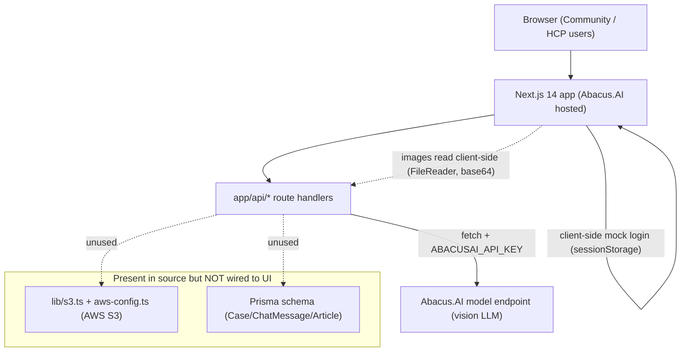
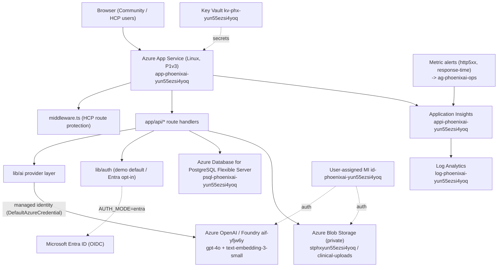

# Part 9 — Original vs Azure Architecture

> Side-by-side architecture of Phoenix AI before (Abacus.AI) and after (Azure), with two Mermaid
> diagrams and a component mapping. Evidence: source code layout, `infra/` Bicep, and the live
> `az resource list` for `rg-phoenixai-demo`.

## 1. Original architecture (Abacus.AI source)

Characteristics:
- Single hosted Next.js app; AI via static API key.
- Mock client-side auth; no server session.
- S3 and Prisma present but **not** used by the visible app.
- No telemetry, health checks, IaC, or automated tests.

## 2. Azure architecture (current)

Characteristics:
- App Service host; AI via managed identity to Azure OpenAI/Foundry.
- Server-verified session + optional Entra ID; HCP routes protected by middleware.
- Managed PostgreSQL + private Blob Storage available; telemetry, health probes, alerts.
- Full Bicep IaC and GitHub OIDC CI/CD.

## 3. Component mapping

| Concern | Original | Azure |
| --- | --- | --- |
| Host | Abacus.AI platform | Azure App Service (`plan-phoenixai-yun55ezsi4yoq`, P1v3) |
| AI model | Abacus endpoint + API key | Azure OpenAI/Foundry `aif-yfjw6y` + managed identity |
| AI integration | inline in routes | `lib/ai/*` provider layer |
| Object storage | AWS S3 (latent) | Azure Blob `stphxyun55ezsi4yoq` (latent, managed identity) |
| Database | Prisma (latent) | Azure PostgreSQL `psql-phoenixai-yun55ezsi4yoq` (partially wired) |
| Auth | client mock | demo (default) / Entra ID (opt-in) + signed session |
| Secrets | env / platform | App Service settings + Key Vault `kv-phx-yun55ezsi4yoq` |
| Identity | static keys | UAMI `id-phoenixai-yun55ezsi4yoq` |
| Observability | none | App Insights + Log Analytics + alerts + action group |
| IaC / CI/CD | none | Bicep (`infra/`) + GitHub OIDC workflows |
| Tests | none | unit/integration/e2e/api/network/visual |

## 4. Live resource inventory (evidence: `az resource list -g rg-phoenixai-demo`)

App Service, App Service Plan, PostgreSQL Flexible Server, Storage account (+ smart-detector
storage), Key Vault, user-assigned managed identity, Log Analytics workspace, Application
Insights, two metric alerts, one action group — **12 resources**, region `southeastasia`.

## 5. Region note

The environment runs in `southeastasia` rather than `eastus2` because the MCAPS sandbox's
region-specific quota blocked the original region. The Foundry AI resource remains in `eastus2`
(`rg-aisgemini-dev`). See [deployment-and-operations-changes.md](../migration/deployment-and-operations-changes.md).
