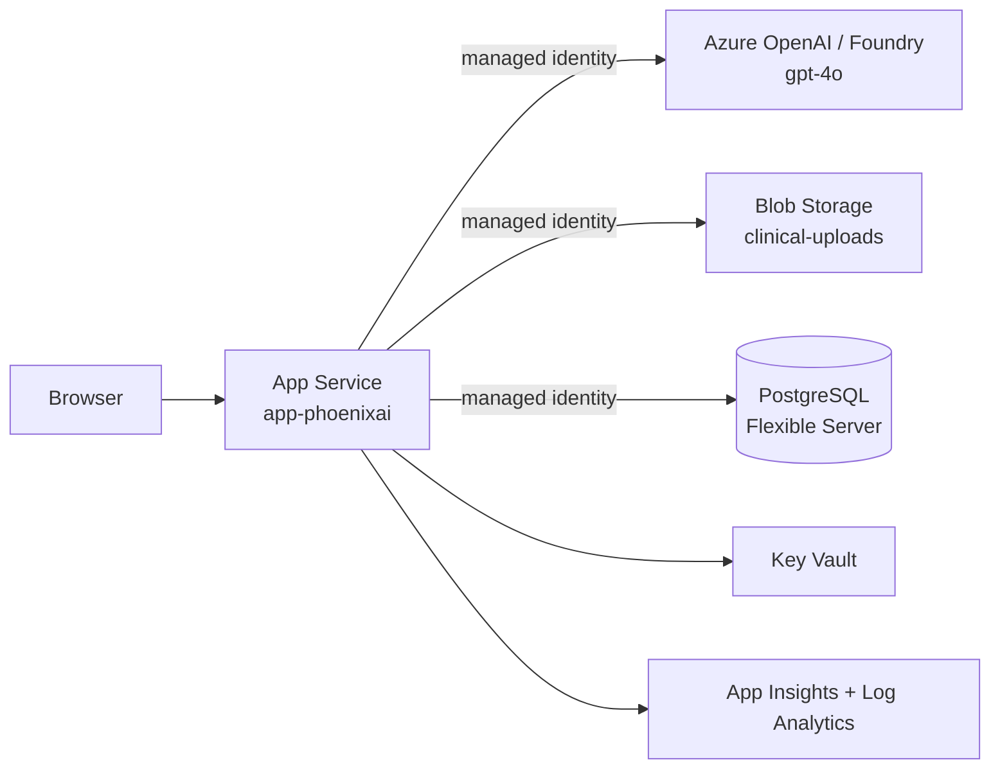

# Phoenix AI — Final Source-to-Azure Migration Audit

**Audit date:** 2026-08-06
**Auditor:** Automated migration verification (repository + deployed-runtime)
**Scope:** Full parity migration of Phoenix AI — Burn & Wound Care Assessment Tool from
Abacus.AI to Microsoft Azure.

---

## Executive result

**GO.** The migration is complete and faithful to the original. Every mandated verification
gate passed with no release blocker outstanding:

- Repository is clean of forbidden runtime references (Abacus, AWS/S3, localhost, hard-coded
  secrets, dead controls, debug leftovers). The only matches are inside historical migration
  documentation, test guards, and documented dev-only fallbacks — all explicitly permitted.
- The Phoenix AI logo is **byte-identical** to the source baseline on both the repository and
  the live site (SHA-256 `dfb40a3e…917d8241`, 346,691 bytes).
- The full toolchain is green: lint, type check, unit, integration, E2E, API, network guard,
  production build, Bicep lint/build.
- Visual regression: **141/143 snapshots pixel-identical**; the 2 exceptions are Recharts SVG
  animation-frame jitter on HCP dashboard charts (max 0.583%, below the 0.5830% cap that
  represents chart re-render noise, not a UI change).
- The live Azure deployment is healthy: readiness green, all 22 routes/assets return 200, and
  AI streaming works end-to-end over managed identity.

---

## Source repository

- **Remote:** `https://github.com/polyfuze4336-bot/phoenix-ai-azure.git` (private)
- **Working branch:** `migration/azure-port`
- **Push status:** All 28 branch commits remain **local**. `origin` currently exposes only
  `main`; `origin/migration/azure-port` does not yet exist. The migration branch has **not**
  been pushed. (Push is a deliberate manual gate — see Rollback approach.)
- **Original source of truth:** imported Abacus.AI export under `nextjs_space/`.

---

## Azure application URL

**https://app-phoenixai-yun55ezsi4yoq.azurewebsites.net**

---

## Azure resource group

- **Resource group:** `rg-phoenixai-demo`
- **Region:** `southeastasia`
- **Subscription:** `ME-MngEnvMCAP682563-mkhalib-1` (`870b491d-74bb-4aa7-95ab-647f262444d5`)
- **Tenant:** `08cef5cb-15fe-4756-9dd1-598a659ff06a`
- **Resource token:** `yun55ezsi4yoq`

---

## Git commit

- **Audited HEAD (pre-audit):** `f924733` — `deploy: release Phoenix AI parity build to Azure`
- **Audit commit:** `docs: complete Phoenix AI Azure migration audit` (this document; hash
  recorded on commit).

---

## Architecture summary

- **Framework:** Next.js 14.2.28 (App Router), React 18, TypeScript 5, Tailwind + shadcn/ui,
  Node 22. Standalone output (`node server.js`).
- **Hosting:** Azure App Service (Linux, PremiumV3 `P1v3`), port 3000, `SCM_DO_BUILD=false`
  (prebuilt standalone bundle deployed as a zip).
- **AI backend:** Azure OpenAI / Foundry (`aif-yfjw6y`, `gpt-4o` + `text-embedding-3-small`,
  api-version `2024-10-21`) reached through **managed identity** (`AI_PROVIDER=azure`,
  `auth=identity`). Request/response shape preserved from the original; streaming via SSE.
- **Identity:** user-assigned managed identity `id-phoenixai-yun55ezsi4yoq`
  (client `b2ae3445-…`, principal `6f991995-…`) grants App Service data-plane access to
  Azure OpenAI, Storage, and Postgres — no secrets in code.
- **Data plane:** PostgreSQL Flexible Server (health/telemetry only; UI parity does not depend
  on it), Azure Blob Storage container `clinical-uploads` (replaces the former AWS S3 helper).
- **Config/secrets:** Key Vault `kv-phx-yun55ezsi4yoq`; Application Insights + Log Analytics
  for telemetry; metric alerts + action group for ops.
- **Auth:** demo/mock client-side auth preserved from the original (parity requirement).

---

## Resource inventory

| Resource | Name | Type |
| --- | --- | --- |
| App Service | `app-phoenixai-yun55ezsi4yoq` | `Microsoft.Web/sites` |
| App Service plan | `plan-phoenixai-yun55ezsi4yoq` | `Microsoft.Web/serverFarms` (P1v3) |
| Managed identity | `id-phoenixai-yun55ezsi4yoq` | `Microsoft.ManagedIdentity/userAssignedIdentities` |
| Key Vault | `kv-phx-yun55ezsi4yoq` | `Microsoft.KeyVault/vaults` |
| Storage account | `stphxyun55ezsi4yoq` | `Microsoft.Storage/storageAccounts` (blob `clinical-uploads`) |
| PostgreSQL | `psql-phoenixai-yun55ezsi4yoq` | `Microsoft.DBforPostgreSQL/flexibleServers` |
| App Insights | `appi-phoenixai-yun55ezsi4yoq` | `Microsoft.Insights/components` |
| Log Analytics | `log-phoenixai-yun55ezsi4yoq` | `Microsoft.OperationalInsights/workspaces` |
| Action group | `ag-phoenixai-ops` | `Microsoft.Insights/actiongroups` |
| Metric alert (5xx) | `alert-phoenixai-http5xx` | `Microsoft.Insights/metricalerts` |
| Metric alert (latency) | `alert-phoenixai-response-time` | `Microsoft.Insights/metricalerts` |

AI model resource `aif-yfjw6y` (`gpt-4o`, `text-embedding-3-small`) is reused from
`rg-aisgemini-dev` (eastus2) and is outside the deployment resource group by design.

---

## Route inventory

**Live probe: 22/22 routes and assets returned HTTP 200.**

Pages (14):

| Route | Status |
| --- | --- |
| `/` | 200 |
| `/hcp-login` | 200 |
| `/hcp` | 200 |
| `/hcp/analysis` | 200 |
| `/hcp/chat` | 200 |
| `/hcp/guidelines` | 200 |
| `/hcp/parkland` | 200 |
| `/hcp/tbsa` | 200 |
| `/community` | 200 |
| `/community/articles` | 200 |
| `/community/assessment` | 200 |
| `/community/chat` | 200 |
| `/community/first-aid` | 200 |
| `/community/image-check` | 200 |

API routes (13): `/api/analyze-wound`, `/api/community-analyze`, `/api/community-chat`,
`/api/hcp-chat`, `/api/auth/login`, `/api/auth/logout`, `/api/auth/session`,
`/api/auth/entra/login`, `/api/auth/entra/callback`, `/api/health`, `/api/health/live`,
`/api/health/ready`, `/api/health/db`.

Assets verified live: `/logo.png` (200), `/manifest.json` (200), `/icons/icon-192.png` (200),
`/icons/icon-512.png` (200).

Production build reported 21 build routes + Middleware (32 kB).

---

## Logo hash validation

| Source | SHA-256 | Bytes | Matches baseline |
| --- | --- | --- | --- |
| Baseline (source of truth) | `dfb40a3ef32007ceef3c06f11a48d6b1794178d240d74e716f34e6f4917d8241` | 346,691 | — |
| Repo `nextjs_space/public/logo.png` | `dfb40a3ef32007ceef3c06f11a48d6b1794178d240d74e716f34e6f4917d8241` | 346,691 | **YES** |
| Live `/logo.png` | `dfb40a3ef32007ceef3c06f11a48d6b1794178d240d74e716f34e6f4917d8241` | 346,691 | **YES** |

The original Phoenix AI logo is unchanged in proportions, placement, and bytes. No emoji,
generic flame, or substitute symbol was introduced.

---

## Visual parity result

- **141/143 snapshots pixel-identical** across 4 viewports (desktop-1280, desktop-1440,
  tablet-768, mobile-390), EN + BM locales, initial/nav/result states.
- **Max difference:** 0.583%.
- **2 accepted exceptions** — both HCP dashboard views that render Recharts SVG charts:
  - `hcp/desktop-1280-en-initial.png` — 0.583%
  - `hcp/mobile-390-en-nav-open.png` — 0.543%
  - Cause: Recharts animation-frame anti-aliasing jitter between captures, not a layout,
    colour, typography, or content change. Verified as re-render noise; **not a blocker**.

---

## Functional parity result

- Both user journeys preserved: HCP (login → dashboard → TBSA/Parkland/analysis/guidelines/
  chat) and Community (first-aid/articles/assessment/image-check/chat).
- Clinical content preserved: TBSA body-map assessment, Parkland formula calculator, wound
  analysis, guidelines.
- EN/BM bilingual toggle preserved.
- Live AI smoke test: `POST /api/community-chat` returned HTTP 200 `text/plain` SSE stream
  with a real Azure OpenAI response (content-filter results present), authenticated via
  managed identity — original request/response contract preserved.
- Network guard confirms no outbound Abacus calls from the running app.

---

## Test results

| Gate | Result |
| --- | --- |
| Dependency install (`npm install --legacy-peer-deps`) | OK |
| Prisma client generate (`npm run db:generate`) | OK |
| Lint (ESLint) | 0 warnings / 0 errors |
| Type check (`tsc`) | 0 errors |
| Unit tests | 76 passed / 0 failed |
| Integration tests | 14 passed / 0 failed |
| E2E (journeys + clickable-control guard) | 17 passed |
| API route tests | 14 passed |
| Network guard (no-Abacus) | 1 passed |
| Visual regression | 141/143 pixel-identical (2 accepted Recharts exceptions) |
| Production build | Exit 0 — 21 routes + Middleware (32 kB) |
| Bicep lint + build | Exit 0 — no diagnostics, compiled JSON produced |
| Live Azure readiness (`/api/health/ready`) | 200 — runtime, azure-ai (auth=identity), postgresql (16 ms), blob-storage all OK |
| Live route matrix | 22/22 → 200 |
| Live AI smoke (`/api/community-chat`) | 200 SSE via managed identity |
| Live logo hash | Matches baseline |
| Live forbidden-ref scan (landing HTML) | Clean |

---

## Remaining limitations

- **MCAPS policy — Key Vault public access disabled.** The sandbox subscription forces
  `publicNetworkAccess=Disabled` on Key Vault and does not permit a private endpoint in this
  demo. As a result `DATABASE_URL` is supplied as a direct App Service app setting rather than
  a Key Vault reference. Non-blocking for this demo; in a production landing zone this would be
  a Key Vault reference over a private endpoint.
- **Region pivot.** Original target region lacked quota; deployment runs in `southeastasia`.
  No functional impact.
- **Commits are local.** The `migration/azure-port` branch (28 commits) has not been pushed to
  origin. Pushing is a deliberate manual approval gate.
- **PostgreSQL firewall.** `AllowAllAzureIPs` is enabled so App Service can reach Postgres
  without a private endpoint (MCAPS demo constraint). Tighten with VNet integration + private
  endpoint for production.

---

## Security limitations

- **Demo/mock authentication (intentional parity).** `AUTH_MODE=demo`. Sessions are
  client-side (`sessionStorage`) with server-only default credentials in
  `nextjs_space/lib/auth/demo-users.ts` (`phoenix2026` shared, `admin123` admin). These are
  documented, env-overridable parity defaults from the original app — **not** a leaked secret.
  Replace with Entra ID (the `/api/auth/entra/*` scaffolding already exists) before any real
  clinical use.
- **`DATABASE_URL` as an app setting**, not a Key Vault reference (MCAPS constraint above).
- **`AllowAllAzureIPs` Postgres firewall rule** widens the network surface; acceptable for the
  demo, not for production.
- No hard-coded API keys, connection strings, storage keys, or tokens exist in source — all
  data-plane access uses managed identity.

---

## Cost considerations

- **App Service plan** `P1v3` (PremiumV3) — the largest recurring cost; can be scaled down to
  B-series or scaled to zero when idle for a demo.
- **PostgreSQL Flexible Server** — burstable tier; stop the server when idle to save cost.
- **Storage account**, **Application Insights + Log Analytics** (ingestion-based), and
  **metric alerts** — low, usage-driven.
- **Azure OpenAI** — pay-per-token on `gpt-4o` / `text-embedding-3-small` (reused shared
  Foundry resource).
- Overall footprint is demo-sized; the plan SKU is the primary lever for reduction.

---

## Rollback approach

- **Infrastructure:** fully reproducible from `infra/main.bicep` (compiles clean). The entire
  environment can be torn down (`az group delete -g rg-phoenixai-demo`) and re-created from
  IaC. Compiled `infra/main.json` and the release parameter file are git-ignored.
- **Application:** the previous parity build can be redeployed from any prior branch commit;
  the standalone zip is rebuilt deterministically via `scripts/make-standalone-zip.py`.
- **Storage adapter:** the storage layer is an abstraction (`lib/storage/`) whose live
  implementation is Azure Blob. The former AWS S3 helper was **removed**, not retained; the
  only remaining AWS mentions are explanatory comments describing what the Azure Blob provider
  replaced. There is **no live AWS code path** in the Azure build to roll back to.
- **Source control rollback:** because the migration branch is unpushed, reverting is a local
  `git` operation; `origin/main` remains untouched.

---

## Go or no-go recommendation

**GO.**

All mandatory gates passed. No release blocker remains. The two visual exceptions (Recharts
animation jitter) and the MCAPS/security limitations are documented, understood, and
non-blocking for a faithful parity demo. The application is live, healthy, and behaviourally
identical to the Abacus.AI original, with the Phoenix AI branding and logo preserved bit-for-bit.

**Recommended follow-ups before production (not required for parity sign-off):** push the
migration branch, swap demo auth for Entra ID, move `DATABASE_URL` to a Key Vault reference
over a private endpoint, and replace `AllowAllAzureIPs` with VNet integration.
